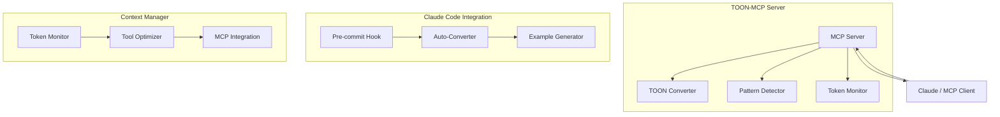

# TOON-MCP: Token-Optimized Object Notation

[](LICENSE)
[](https://www.python.org/downloads/)
[](https://modelcontextprotocol.io)

TOON-MCP is a Model Context Protocol server that automatically converts verbose JSON structures into **Token-Optimized Object Notation (TOON)**, reducing token consumption in AI-assisted development workflows by up to **60%**.

## 🚀 Features

- **Smart Compression**: Automatic pattern detection and intelligent JSON optimization
- **Token Monitoring**: Real-time tracking of conversation token usage with optimization recommendations
- **MCP Integration**: Seamless integration with Claude and other MCP clients
- **Lossless Conversion**: Perfect round-trip conversion between JSON and TOON
- **Auto-Optimization**: Proactive conversion of tool outputs for maximum efficiency
- **Pre-commit Hooks**: Scan code for JSON and suggest TOON conversions
- **Context Management**: Monitor and optimize token usage across conversations

## 📊 Quick Example

**Original JSON** (142 tokens):
```json
{
  "id": 12345,
  "name": "John Doe",
  "email": "john@example.com",
  "type": "user",
  "status": "active",
  "metadata": {
    "created_at": "2025-01-01T00:00:00Z",
    "updated_at": "2025-01-15T10:30:00Z"
  }
}
```

**TOON Format** (68 tokens, **52% reduction**):
```json
{"_toon":"1.0","d":{"i":12345,"n":"John Doe","eml":"john@example.com","t":"user","s":"active","meta":{"ca":"2025-01-01T00:00:00Z","ua":"2025-01-15T10:30:00Z"}}}
```

## 📦 Installation

### Prerequisites

- Python 3.10 or higher
- pip package manager

### Quick Install

```bash
# Clone the repository
git clone https://github.com/aj-geddes/toon-context-mcp.git
cd toon-context-mcp

# Install TOON-MCP
cd mcp-server-toon
pip install -e .
```

### Docker Installation

TOON-MCP can be run in a Docker container for easy deployment and isolation:

```bash
# Clone the repository
git clone https://github.com/aj-geddes/toon-context-mcp.git
cd toon-context-mcp/mcp-server-toon

# Build the Docker image
docker build -t toon-mcp-server:latest .

# Run with Docker
docker run -i toon-mcp-server:latest

# Or use Docker Compose
docker-compose up -d
```

**Note**: The Docker image uses Debian-based Python (python:3.10-slim) for optimal performance, not Alpine.

For MCP integration with Docker, update your Claude Desktop config to use the containerized server:

```json
{
  "mcpServers": {
    "toon": {
      "command": "docker",
      "args": ["run", "-i", "toon-mcp-server:latest"]
    }
  }
}
```

### MCP Configuration

Add to your Claude Desktop config (`~/.config/Claude/claude_desktop_config.json`):

```json
{
  "mcpServers": {
    "toon": {
      "command": "python",
      "args": ["-m", "src.server"],
      "cwd": "/path/to/toon-context-mcp/mcp-server-toon"
    }
  }
}
```

## 🎯 Project Structure

```
toon-context-mcp/
├── mcp-server-toon/          # Phase 1: Core MCP Server
│   ├── src/
│   │   ├── toon_converter.py  # Core TOON logic
│   │   ├── server.py          # MCP server
│   │   └── patterns.py        # Pattern detection
│   ├── tests/
│   │   └── test_conversions.py
│   ├── pyproject.toml
│   └── README.md
├── claude-code-integration/   # Phase 2: Claude Code Integration
│   ├── auto_converter.py      # Auto-conversion system
│   └── example_generator.py   # TOON example generator
├── context-manager/           # Phase 3: Context Manager
│   ├── token_monitor.py       # Token usage monitoring
│   ├── tool_output_optimizer.py # Proactive conversion
│   └── mcp_integration.py     # MCP integration helpers
├── docs/                      # Complete Jekyll documentation
│   ├── index.md
│   ├── guides/
│   │   ├── setup.md
│   │   ├── user-guide.md
│   │   └── troubleshooting.md
│   └── api/
│       └── reference.md
└── .git/hooks/
    └── pre-commit              # JSON scanning hook
```

## 🔧 Usage

### Basic Conversion

```python
from src.toon_converter import convert_json_to_toon, convert_toon_to_json

# Convert to TOON
toon_format = convert_json_to_toon(your_json_data)

# Convert back to JSON
original = convert_toon_to_json(toon_format)
```

### MCP Tools

Use these tools in Claude:

- `convert_to_toon` - Convert JSON to TOON format
- `convert_to_json` - Convert TOON back to JSON
- `analyze_patterns` - Detect optimization patterns
- `get_compression_strategy` - Get optimal compression strategy
- `calculate_savings` - Calculate token savings
- `batch_convert` - Convert multiple JSON objects

### Token Monitoring

```python
from context_manager.token_monitor import TokenMonitor

monitor = TokenMonitor(warn_threshold=50000)

# Analyze messages
monitor.analyze_message(message_content, role='user')

# Get metrics
metrics = monitor.get_metrics()
print(f"Total tokens: {metrics.total_tokens:,}")
print(f"Potential savings: {metrics.savings_percent:.1f}%")
```

### Tool Output Optimization

```python
from context_manager.tool_output_optimizer import ToolOutputOptimizer

optimizer = ToolOutputOptimizer(auto_optimize=True, min_savings=15.0)

# Automatically optimize tool outputs
optimized, metadata = optimizer.optimize_tool_output("api_call", tool_output)
```

## 📚 Documentation

Complete documentation available at `/docs`:

- **[Setup Guide](docs/guides/setup.md)** - Installation and configuration
- **[User Guide](docs/guides/user-guide.md)** - Usage patterns and examples
- **[Troubleshooting](docs/guides/troubleshooting.md)** - Common issues and solutions
- **[API Reference](docs/api/reference.md)** - Complete API documentation

### View Documentation Locally

```bash
cd docs
# Install Jekyll (if not already installed)
gem install bundler jekyll

# Create Gemfile
cat > Gemfile << 'EOF'
source "https://rubygems.org"
gem "jekyll", "~> 4.3"
gem "minima", "~> 2.5"
gem "jekyll-seo-tag"
gem "jekyll-sitemap"
gem "jekyll-feed"
EOF

# Install and serve
bundle install
bundle exec jekyll serve

# Open http://localhost:4000
```

## 🧪 Testing

```bash
cd mcp-server-toon
pytest tests/ -v
```

## 🎨 Features by Phase

### Phase 1: Core MCP Server ✅

- TOON converter with smart compression
- Pattern detection system
- MCP server with 6 tools
- Comprehensive test suite
- Package configuration

### Phase 2: Claude Code Integration ✅

- Pre-commit hook for JSON scanning
- Auto-conversion system for code/docs
- TOON example generator
- Multiple language support

### Phase 3: Context Manager ✅

- Token usage monitoring
- Proactive tool output conversion
- MCP server integration helpers
- Optimization recommendations

## 📈 Performance

Typical token savings by data type:

- **API Responses**: 40-60% savings
- **Database Results**: 50-65% savings
- **Configuration Files**: 35-50% savings
- **Arrays of Objects**: 55-70% savings

## 🤝 Contributing

Contributions welcome! Please:

1. Fork the repository
2. Create a feature branch
3. Run tests: `pytest tests/ -v`
4. Submit a pull request

## 📄 License

MIT License - see [LICENSE](LICENSE) file for details

## 🔗 Links

- **Documentation**: See `/docs` directory
- **Issues**: [GitHub Issues](https://github.com/aj-geddes/toon-context-mcp/issues)
- **Discussions**: [GitHub Discussions](https://github.com/aj-geddes/toon-context-mcp/discussions)

## 🌟 Why TOON?

In AI-assisted development, token limits can constrain your workflow. TOON helps you:

- **Fit more context** in conversations
- **Reduce API costs** with fewer tokens
- **Improve response times** with smaller payloads
- **Work with larger datasets** within token limits

## 📊 Architecture



## 🎯 Roadmap

- [x] Core TOON converter
- [x] MCP server implementation
- [x] Pattern detection
- [x] Claude Code integration
- [x] Context manager
- [x] Complete documentation
- [ ] TypeScript/JavaScript port
- [ ] VSCode extension
- [ ] Browser extension
- [ ] Performance benchmarks
- [ ] Community templates

## 💡 Use Cases

1. **Large Codebase Analysis**: Compress file listings and search results
2. **API Integration**: Optimize API response storage in conversations
3. **Database Queries**: Reduce token usage when sharing query results
4. **Configuration Management**: Store configs in compact format
5. **Documentation**: Include examples without token overhead

---

**Built with ❤️ for the AI development community**

*Reduce tokens. Increase productivity.*
