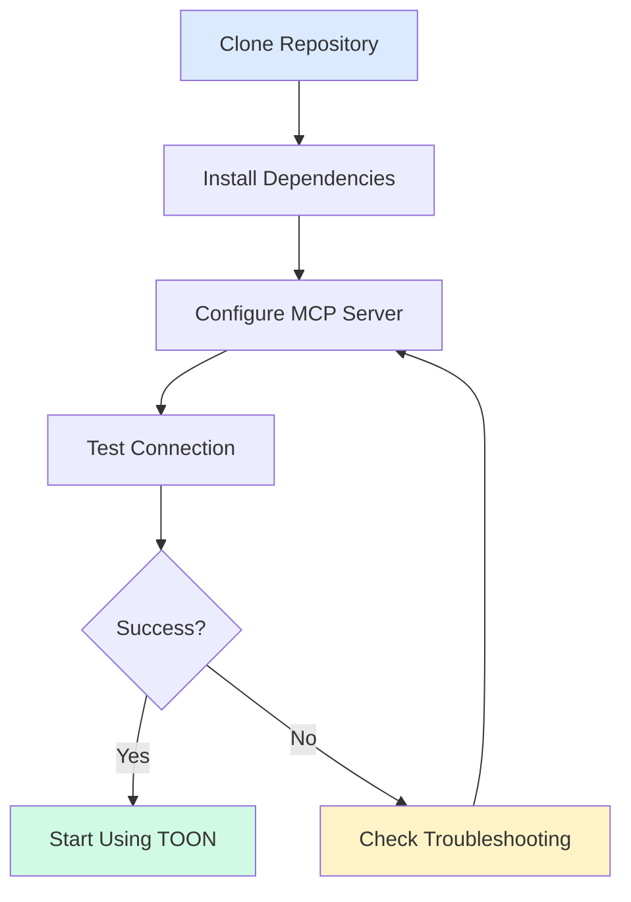
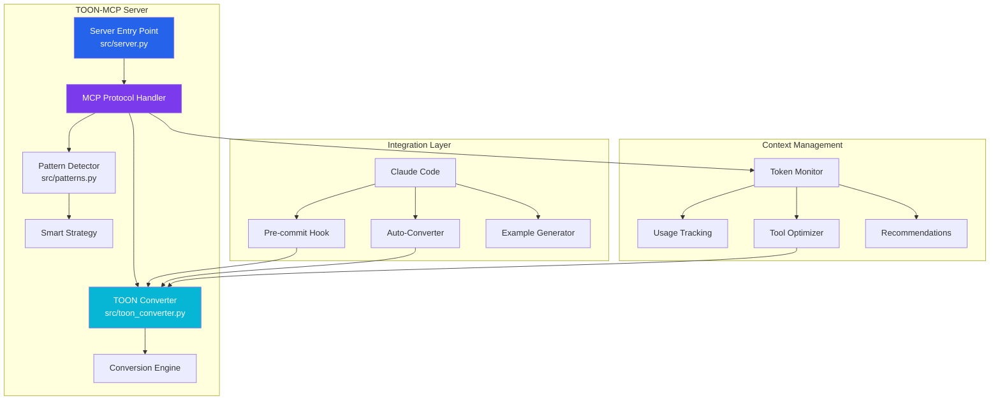
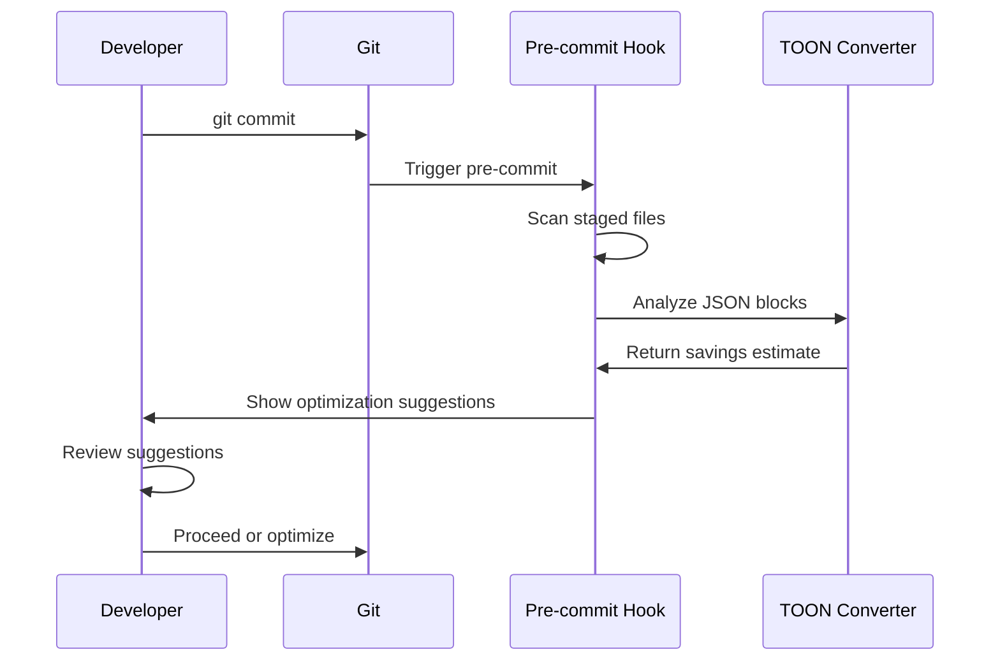

## Installation

### Prerequisites

- Python 3.10 or higher
- pip package manager
- Git (for cloning the repository)

### Step 1: Clone the Repository

```bash
git clone https://github.com/aj-geddes/toon-context-mcp.git
cd toon-context-mcp
```

### Step 2: Install Dependencies

```bash
cd mcp-server-toon
pip install -e .
```

This will install:
- MCP SDK
- Required dependencies
- Development tools (pytest, black, ruff)

### Step 3: Verify Installation

```bash
python -c "from src.toon_converter import convert_json_to_toon; print('✅ TOON installed successfully')"
```

## MCP Server Configuration

### Installation Flow



### Claude Desktop Configuration

Add TOON to your Claude Desktop MCP settings:

**Location**:
- macOS: `~/Library/Application Support/Claude/claude_desktop_config.json`
- Windows: `%APPDATA%\Claude\claude_desktop_config.json`
- Linux: `~/.config/Claude/claude_desktop_config.json`

**Configuration**:

```json
{
  "mcpServers": {
    "toon": {
      "command": "python",
      "args": [
        "-m",
        "src.server"
      ],
      "cwd": "/path/to/toon-context-mcp/mcp-server-toon"
    }
  }
}
```

<div class="alert alert-warning">
    <strong>⚠️ Important</strong><br>
    Replace <code>/path/to/toon-context-mcp</code> with the actual absolute path to your installation.
</div>

### Claude Code (VS Code) Configuration

Add to your `.claude/mcp_settings.json`:

```json
{
  "mcpServers": {
    "toon": {
      "command": "python",
      "args": ["-m", "src.server"],
      "cwd": "${workspaceFolder}/mcp-server-toon"
    }
  }
}
```

## Component Architecture



## Optional Components

### 1. Pre-commit Hook

Enable automatic JSON scanning in git commits:

```bash
# The hook is already installed at .git/hooks/pre-commit
chmod +x .git/hooks/pre-commit
```

**How it works**:



### 2. Context Manager

Monitor token usage in your conversations:

```python
from context_manager.token_monitor import TokenMonitor

monitor = TokenMonitor(
    warn_threshold=50000,
    critical_threshold=100000
)

# Analyze message
usage = monitor.analyze_message(message_content, role='user')

# Get metrics
metrics = monitor.get_metrics()
print(f"Total tokens: {metrics.total_tokens}")
print(f"Potential savings: {metrics.savings_percent}%")
```

### 3. Tool Output Optimizer

Automatically optimize MCP tool outputs:

```python
from context_manager.tool_output_optimizer import ToolOutputOptimizer

optimizer = ToolOutputOptimizer(
    auto_optimize=True,
    min_savings=15.0
)

# Optimize tool output
optimized, metadata = optimizer.optimize_tool_output(
    "file_search",
    tool_output
)
```

## Configuration Options

### Server Configuration

Edit `mcp-server-toon/src/server.py` to customize:

```python
class TOONMCPServer:
    def __init__(self):
        self.converter = TOONConverter(aggressive=False)
        # Set aggressive=True for maximum compression
```

### Converter Settings

```python
from src.toon_converter import TOONConverter

# Default mode (balanced)
converter = TOONConverter(aggressive=False)

# Aggressive mode (maximum compression)
converter = TOONConverter(aggressive=True)
```

### Pattern Detection Tuning

```python
from src.patterns import PatternDetector

detector = PatternDetector()
patterns = detector.analyze(data)

# Get custom abbreviations
suggestions = detector.suggest_custom_abbreviations()
```

## Environment Variables

Configure TOON behavior with environment variables:

```bash
# Enable TOON optimization
export TOON_OPTIMIZE=true

# Minimum savings percentage to trigger optimization
export TOON_MIN_SAVINGS=15

# Enable debug logging
export TOON_DEBUG=true
```

## Testing Your Installation

### 1. Basic Conversion Test

```python
from src.toon_converter import convert_json_to_toon, convert_toon_to_json

# Test data
data = {
    "id": 123,
    "name": "Test User",
    "status": "active"
}

# Convert to TOON
toon = convert_json_to_toon(data)
print(f"TOON: {toon}")

# Convert back
original = convert_toon_to_json(toon)
print(f"Round-trip successful: {original == data}")
```

### 2. MCP Server Test

```bash
# Start the server
cd mcp-server-toon
python -m src.server
```

The server should start without errors and display:
```
INFO:toon-mcp-server:Starting TOON MCP Server...
```

### 3. Run Test Suite

```bash
cd mcp-server-toon
pytest tests/ -v
```

Expected output:
```
tests/test_conversions.py::TestTOONConverter::test_simple_object_conversion PASSED
tests/test_conversions.py::TestTOONConverter::test_round_trip_conversion PASSED
...
======================== XX passed in X.XXs ========================
```

## Verification Checklist

- [ ] Python 3.10+ installed
- [ ] Repository cloned
- [ ] Dependencies installed
- [ ] MCP server configured in Claude
- [ ] Basic conversion test passes
- [ ] MCP server starts without errors
- [ ] Test suite passes
- [ ] Pre-commit hook enabled (optional)

## Next Steps

<div class="alert alert-success">
    <strong>✅ Installation Complete!</strong><br>
    You're ready to start using TOON. Check out the <a href="/guides/user-guide">User Guide</a> to learn how to use TOON effectively.
</div>

### Recommended Reading

1. [User Guide](/guides/user-guide) - Learn TOON usage patterns
2. [API Reference](/api/reference) - Explore all available tools
3. [Troubleshooting](/guides/troubleshooting) - Common issues and solutions

## Advanced Setup

### Custom MCP Tool Integration

Wrap your existing MCP tools with TOON optimization:

```python
from context_manager.tool_output_optimizer import SmartToolWrapper, ToolOutputOptimizer

optimizer = ToolOutputOptimizer()

# Wrap your tool
@SmartToolWrapper(my_tool_function, "my_tool", optimizer)
async def optimized_tool(*args, **kwargs):
    # Tool automatically optimizes output
    pass
```

### Integration with Multiple MCP Servers

```json
{
  "mcpServers": {
    "toon": {
      "command": "python",
      "args": ["-m", "src.server"]
    },
    "filesystem": {
      "command": "npx",
      "args": ["-y", "@modelcontextprotocol/server-filesystem", "/path/to/files"],
      "env": {
        "TOON_OPTIMIZE": "true"
      }
    },
    "github": {
      "command": "npx",
      "args": ["-y", "@modelcontextprotocol/server-github"],
      "env": {
        "TOON_OPTIMIZE": "true",
        "GITHUB_TOKEN": "${GITHUB_TOKEN}"
      }
    }
  }
}
```

### Development Setup

For contributors:

```bash
# Install development dependencies
pip install -e ".[dev]"

# Install pre-commit hooks
pre-commit install

# Run linting
black src/ tests/
ruff src/ tests/

# Run tests with coverage
pytest tests/ --cov=src --cov-report=html
```

---

Need help? Check the [Troubleshooting Guide]({{ '/guides/troubleshooting' | relative_url }}) or [open an issue](https://github.com/aj-geddes/toon-context-mcp/issues).
