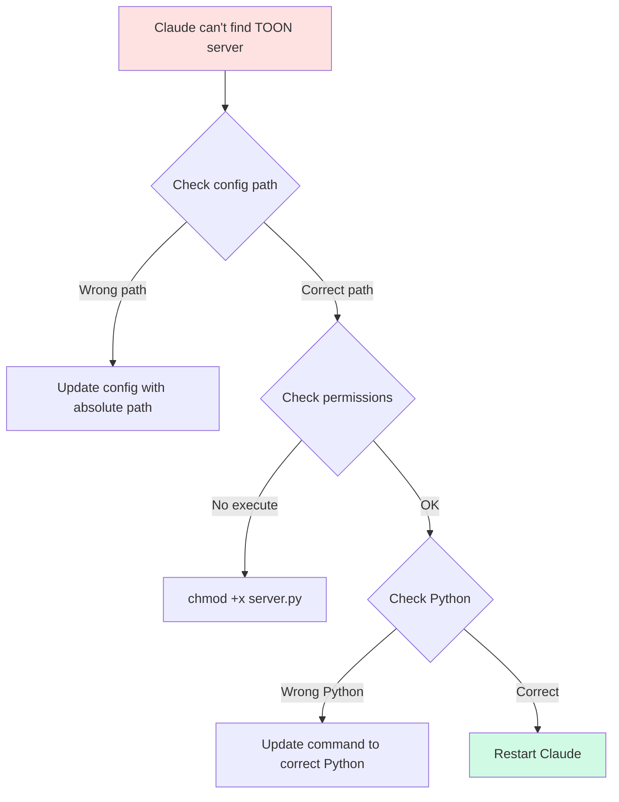

## Common Issues

### Installation Issues

#### Issue: Module Not Found Error

```
ModuleNotFoundError: No module named 'mcp'
```

**Solution**:

```bash
# Install MCP dependency
pip install mcp

# Or reinstall TOON-MCP
cd mcp-server-toon
pip install -e .
```

#### Issue: Python Version Error

```
ERROR: Package 'toon-mcp-server' requires Python >=3.10
```

**Solution**:

```bash
# Check Python version
python --version

# If <3.10, upgrade Python or use pyenv
pyenv install 3.10
pyenv local 3.10
```

#### Issue: Permission Denied on Installation

```
ERROR: Could not install packages due to an EnvironmentError: [Errno 13] Permission denied
```

**Solution**:

```bash
# Use pip with --user flag
pip install --user -e .

# Or use virtual environment (recommended)
python -m venv venv
source venv/bin/activate  # On Windows: venv\Scripts\activate
pip install -e .
```

### Configuration Issues

#### Issue: MCP Server Not Found in Claude



**Solution**:

1. Verify config path:

```bash
# macOS/Linux
cat ~/.config/Claude/claude_desktop_config.json

# Windows
type %APPDATA%\Claude\claude_desktop_config.json
```

2. Ensure absolute paths:

```json
{
  "mcpServers": {
    "toon": {
      "command": "/usr/bin/python3",
      "args": ["-m", "src.server"],
      "cwd": "/absolute/path/to/mcp-server-toon"
    }
  }
}
```

3. Find correct Python path:

```bash
which python3  # macOS/Linux
where python   # Windows
```

4. Restart Claude Desktop completely

#### Issue: Server Starts But Tools Not Available

**Diagnostic**:

```bash
# Test server manually
cd mcp-server-toon
python -m src.server

# Should output:
# INFO:toon-mcp-server:Starting TOON MCP Server...
```

**Solution**:

1. Check for errors in server output
2. Verify MCP SDK version:

```bash
pip show mcp
# Should be >=0.9.0
```

3. Update if needed:

```bash
pip install --upgrade mcp
```

### Docker Issues

#### Issue: Docker Image Build Fails

```
ERROR: failed to solve: process "/bin/sh -c pip install..." did not complete successfully
```

**Solution**:

```bash
# Clean Docker cache and rebuild
docker system prune -a
docker build --no-cache -t toon-mcp-server:latest .

# Check Docker disk space
docker system df
```

#### Issue: Container Exits Immediately

```bash
docker ps -a
# Shows: Exited (1) 2 seconds ago
```

**Diagnosis**:

```bash
# Check container logs
docker logs toon-mcp-server

# Run interactively to debug
docker run -it toon-mcp-server:latest /bin/bash

# Test server manually inside container
python -m src.server
```

**Common Causes**:

1. **Missing dependencies**: Check Dockerfile COPY commands
2. **Python path issues**: Verify PYTHONPATH in container
3. **Permission issues**: Ensure non-root user has access

**Solution**:

```dockerfile
# Ensure proper ownership in Dockerfile
RUN chown -R toon:toon /app

# Verify Python can import modules
RUN python -c "from src.server import main; print('OK')"
```

#### Issue: Docker MCP Integration Not Working

**Configuration Issue**:

```json
{
  "mcpServers": {
    "toon": {
      "command": "docker",
      "args": ["run", "-i", "toon-mcp-server:latest"]
    }
  }
}
```

**Diagnostic Steps**:

```bash
# Test Docker command manually
echo '{"test": "data"}' | docker run -i toon-mcp-server:latest

# Check if image exists
docker images | grep toon-mcp-server

# Verify Docker daemon is running
docker info
```

**Solution**:

1. Ensure Docker image is built:
```bash
cd mcp-server-toon
docker build -t toon-mcp-server:latest .
```

2. Test container can start:
```bash
docker run --rm -i toon-mcp-server:latest
```

3. Restart Claude Desktop after configuration changes

#### Issue: Permission Denied (Docker)

```
Got permission denied while trying to connect to the Docker daemon socket
```

**Solution**:

```bash
# Linux: Add user to docker group
sudo usermod -aG docker $USER

# Log out and log back in for changes to take effect

# macOS: Ensure Docker Desktop is running
open -a Docker

# Windows: Run Docker Desktop as administrator
```

#### Issue: Container Resource Limits

**Symptoms**: Container is slow or crashes under load

**Diagnosis**:

```bash
# Check container resource usage
docker stats toon-mcp-server

# View container details
docker inspect toon-mcp-server | grep -A 10 "Memory"
```

**Solution**:

Edit `docker-compose.yml`:

```yaml
services:
  toon-mcp-server:
    deploy:
      resources:
        limits:
          cpus: '2'        # Increase CPU limit
          memory: 1024M    # Increase memory limit
        reservations:
          cpus: '1'
          memory: 512M
```

Then restart:

```bash
docker-compose down
docker-compose up -d
```

#### Issue: Docker Image Too Large

```bash
docker images
# Shows: toon-mcp-server   latest   800MB
```

**Solution**:

```dockerfile
# Use slim base image (already implemented)
FROM python:3.10-slim

# Add multi-stage build for even smaller images
FROM python:3.10-slim as builder
WORKDIR /app
COPY requirements.txt .
RUN pip install --user -r requirements.txt

FROM python:3.10-slim
WORKDIR /app
COPY --from=builder /root/.local /root/.local
COPY src/ ./src/
ENV PATH=/root/.local/bin:$PATH
CMD ["python", "-m", "src.server"]
```

**Verification**:

```bash
# Check image size after rebuild
docker images toon-mcp-server

# Remove dangling images
docker image prune
```

### Conversion Issues

#### Issue: Round-Trip Conversion Fails

```python
original != restored  # AssertionError
```

**Diagnosis**:

```python
from src.toon_converter import convert_json_to_toon, convert_toon_to_json
import json

# Test with your data
original = {"test": "data"}
toon = convert_json_to_toon(original)
restored = json.loads(convert_toon_to_json(toon))

print(f"Original: {original}")
print(f"TOON: {toon}")
print(f"Restored: {restored}")
print(f"Match: {original == restored}")
```

**Common Causes**:

1. **Float precision**: Python floats may lose precision
2. **Special characters**: Ensure proper JSON escaping
3. **Encoding**: Use UTF-8 consistently

**Solution**:

```python
# For float precision issues
import json

# Use parse_float parameter
restored = json.loads(
    convert_toon_to_json(toon),
    parse_float=lambda x: round(float(x), 6)
)
```

#### Issue: Low Savings Percentage

```
Expected: 50% savings
Actual: 10% savings
```

**Diagnosis**:

```python
from src.patterns import PatternDetector

detector = PatternDetector()
patterns = detector.analyze(your_data)

# Check detected patterns
for pattern in patterns:
    print(f"{pattern.pattern_type}: {pattern.confidence}")

# Get recommendations
recommendations = detector.get_compression_recommendations()
for rec in recommendations:
    print(rec)
```

**Solutions**:

1. **Enable aggressive mode**:

```python
from src.toon_converter import TOONConverter
converter = TOONConverter(aggressive=True)
```

2. **Check data structure**:
   - Small objects won't benefit much
   - Unique keys reduce savings
   - Short strings have less compression potential

3. **Use appropriate data**:
   - TOON works best with arrays of similar objects
   - Repeated keys benefit most
   - Database results are ideal candidates

### Performance Issues

#### Issue: Slow Conversion Speed

**Diagnosis**:

```python
import time

start = time.time()
toon = convert_json_to_toon(large_data)
duration = time.time() - start

print(f"Conversion took {duration:.2f} seconds")
```

**Solutions**:

1. **Disable pattern detection for large data**:

```python
converter = TOONConverter()
# Skip pattern detection
converter.ref_cache = {}
toon = converter._convert_to_toon(data)
```

2. **Use batch processing**:

```python
# Instead of converting one by one
for item in items:
    toon = convert_json_to_toon(item)  # Slow

# Convert as batch
toon = convert_json_to_toon(items)  # Faster
```

3. **Cache conversions**:

```python
from functools import lru_cache
import json

@lru_cache(maxsize=128)
def cached_convert(json_str):
    return convert_json_to_toon(json.loads(json_str))
```

### Tool Output Optimization Issues

#### Issue: Auto-Optimization Not Working

**Diagnosis**:

```python
from context_manager.tool_output_optimizer import ToolOutputOptimizer

optimizer = ToolOutputOptimizer(auto_optimize=True, min_savings=15.0)

# Check settings
print(f"Auto-optimize: {optimizer.auto_optimize}")
print(f"Min savings: {optimizer.min_savings}")

# Test with sample data
output, metadata = optimizer.optimize_tool_output("test", sample_data)
print(f"Optimized: {metadata['optimized']}")
print(f"Reason: {metadata.get('reason', 'N/A')}")
```

**Solutions**:

1. **Lower savings threshold**:

```python
optimizer = ToolOutputOptimizer(min_savings=10.0)  # More aggressive
```

2. **Check output format**:

```python
# Must be JSON-serializable
sample_data = {"test": "data"}  # Good
sample_data = "plain string"     # Won't optimize
```

3. **Verify output size**:

```python
import json
output_json = json.dumps(sample_data)
print(f"Output size: {len(output_json)} chars")

# Small outputs (<100 chars) may not meet threshold
```

### Token Monitor Issues

#### Issue: Inaccurate Token Counts

**Note**: TOON uses character-based estimation (chars/4). For exact counts, use tiktoken:

```bash
pip install tiktoken
```

```python
import tiktoken

# Get exact token count
encoding = tiktoken.get_encoding("cl100k_base")
tokens = encoding.encode(text)
exact_count = len(tokens)

print(f"Estimated: {len(text) // 4}")
print(f"Exact: {exact_count}")
```

#### Issue: Threshold Warnings Not Showing

**Diagnosis**:

```python
from context_manager.token_monitor import TokenMonitor

monitor = TokenMonitor(
    warn_threshold=50000,
    critical_threshold=100000
)

# Check current count
metrics = monitor.get_metrics()
print(f"Current tokens: {metrics.total_tokens}")
print(f"Warn threshold: {monitor.warn_threshold}")

# Manually check
warning = monitor.check_thresholds()
print(f"Warning: {warning}")
```

**Solution**:

```python
# Lower thresholds for testing
monitor = TokenMonitor(
    warn_threshold=100,   # Low threshold
    critical_threshold=500
)
```

### Pre-commit Hook Issues

#### Issue: Hook Not Running

**Diagnosis**:

```bash
# Check if hook exists
ls -la .git/hooks/pre-commit

# Check if executable
stat .git/hooks/pre-commit
```

**Solution**:

```bash
# Make executable
chmod +x .git/hooks/pre-commit

# Test manually
.git/hooks/pre-commit
```

#### Issue: Hook Fails with Import Error

```
ModuleNotFoundError: No module named 'src.toon_converter'
```

**Solution**:

1. Install TOON in development mode:

```bash
cd mcp-server-toon
pip install -e .
```

2. Or update hook to use absolute path:

```python
# In .git/hooks/pre-commit
import sys
from pathlib import Path

sys.path.insert(0, str(Path(__file__).parent.parent.parent / "mcp-server-toon"))
```

### MCP Integration Issues

#### Issue: Multiple Servers Conflict

**Symptom**: TOON server works alone but fails with other servers

**Solution**:

1. Check for port conflicts
2. Isolate server environments:

```json
{
  "mcpServers": {
    "toon": {
      "command": "python",
      "args": ["-m", "src.server"],
      "env": {
        "PYTHONPATH": "/path/to/toon-mcp"
      }
    },
    "other-server": {
      "command": "node",
      "args": ["server.js"]
    }
  }
}
```

#### Issue: Environment Variables Not Set

**Diagnosis**:

```bash
# In your shell
echo $TOON_OPTIMIZE
echo $TOON_MIN_SAVINGS
```

**Solution**:

Add to MCP config:

```json
{
  "mcpServers": {
    "toon": {
      "command": "python",
      "args": ["-m", "src.server"],
      "env": {
        "TOON_OPTIMIZE": "true",
        "TOON_MIN_SAVINGS": "15"
      }
    }
  }
}
```

## Debugging Tips

### Enable Debug Logging

```python
import logging

logging.basicConfig(
    level=logging.DEBUG,
    format='%(asctime)s - %(name)s - %(levelname)s - %(message)s'
)

# Now all TOON operations will log details
```

### Test Individual Components

```python
# Test converter
from src.toon_converter import TOONConverter
converter = TOONConverter()
print("✅ Converter initialized")

# Test patterns
from src.patterns import PatternDetector
detector = PatternDetector()
print("✅ Detector initialized")

# Test monitor
from context_manager.token_monitor import TokenMonitor
monitor = TokenMonitor()
print("✅ Monitor initialized")
```

### Verify Data Integrity

```python
def verify_toon_conversion(data):
    """Verify TOON conversion preserves data."""
    import json
    from src.toon_converter import convert_json_to_toon, convert_toon_to_json

    # Convert
    toon = convert_json_to_toon(data)
    restored = json.loads(convert_toon_to_json(toon))

    # Compare
    if restored == data:
        print("✅ Conversion preserves data")
        return True
    else:
        print("❌ Data mismatch!")
        print(f"Original: {data}")
        print(f"Restored: {restored}")
        return False

# Test with your data
verify_toon_conversion(your_data)
```

## Getting Help

### Before Opening an Issue

1. **Check this troubleshooting guide**
2. **Search existing issues**: [GitHub Issues](https://github.com/aj-geddes/toon-context-mcp/issues)
3. **Verify installation**: Run test suite
4. **Collect diagnostic info**:

```bash
# System info
python --version
pip show mcp
pip show toon-mcp-server

# Test basic functionality
python -c "from src.toon_converter import convert_json_to_toon; print('OK')"

# Run tests
pytest tests/ -v
```

### Opening an Issue

Include:

1. **TOON version**: `pip show toon-mcp-server`
2. **Python version**: `python --version`
3. **Operating System**: macOS/Windows/Linux
4. **Error message**: Full traceback
5. **Minimal reproduction**:

```python
# Example that reproduces the issue
from src.toon_converter import convert_json_to_toon

data = {"your": "data"}
result = convert_json_to_toon(data)  # Error occurs here
```

### Community Support

- **GitHub Discussions**: [Ask questions](https://github.com/aj-geddes/toon-context-mcp/discussions)
- **Discord**: [Join our community](#) (Coming soon)
- **Stack Overflow**: Tag `toon-mcp`

## FAQ

### Q: Is TOON lossless?

**A**: Yes! TOON is 100% lossless. All data is perfectly preserved during conversion.

### Q: Can I use TOON in production?

**A**: TOON is designed for development tools and documentation. For production data, verify thoroughly first.

### Q: What's the maximum data size TOON can handle?

**A**: TOON can handle any size that fits in memory. Performance may degrade for very large datasets (>10MB JSON).

### Q: Does TOON work with all JSON?

**A**: Yes, any valid JSON can be converted to TOON. However, benefits vary based on data structure.

### Q: Can I customize TOON abbreviations?

**A**: Yes! You can extend the `KEY_ABBREV` dictionary in `toon_converter.py` or use pattern detection to suggest custom abbreviations.

### Q: Is TOON compatible with other tools?

**A**: TOON outputs valid JSON, so any JSON-compatible tool can work with TOON format after conversion.

## Still Having Issues?

If you're still experiencing problems:

1. Join our [GitHub Discussions](https://github.com/aj-geddes/toon-context-mcp/discussions)
2. [Open an issue](https://github.com/aj-geddes/toon-context-mcp/issues/new)
3. Check the [API Reference]({{ '/api/reference' | relative_url }}) for detailed documentation

---

**Last Updated**: 2025-01-17
**Version**: 1.0.0
