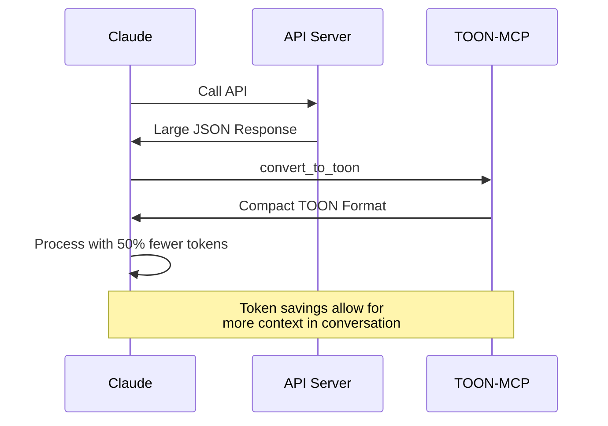

## Introduction

TOON-MCP helps you optimize token usage in AI-assisted development by converting verbose JSON to compact TOON format. This guide covers all usage patterns and best practices.

## Basic Usage

### Converting JSON to TOON

```python
from src.toon_converter import convert_json_to_toon

# Your JSON data
data = {
    "id": 12345,
    "name": "John Doe",
    "email": "john@example.com",
    "status": "active"
}

# Convert to TOON
toon_format = convert_json_to_toon(data)
print(toon_format)
# Output: {"_toon":"1.0","d":{"i":12345,"n":"John Doe","eml":"john@example.com","s":"active"}}
```

### Converting TOON to JSON

```python
from src.toon_converter import convert_toon_to_json

toon_data = '{"_toon":"1.0","d":{"i":12345,"n":"John Doe"}}'
original_json = convert_toon_to_json(toon_data)
print(original_json)
```

### Using the TOONConverter Class

```python
from src.toon_converter import TOONConverter

# Create converter
converter = TOONConverter(aggressive=False)

# Convert
toon = converter.json_to_toon(data)
original = converter.toon_to_json(toon)

# Calculate savings
savings = converter.calculate_savings(original_json, toon)
print(f"Saved {savings['savings_percent']}% tokens")
```

## MCP Tools

TOON-MCP provides several MCP tools for use in Claude:

### 1. convert_to_toon

Convert JSON data to TOON format:

```
Use the convert_to_toon tool:
- json_data: <your JSON as string>
- aggressive: false (optional, set to true for maximum compression)
```

**Example**:
```json
{
  "tool": "convert_to_toon",
  "arguments": {
    "json_data": "{\"id\": 123, \"name\": \"Test\"}",
    "aggressive": false
  }
}
```

### 2. convert_to_json

Convert TOON back to JSON:

```
Use the convert_to_json tool:
- toon_data: <TOON formatted string>
```

### 3. analyze_patterns

Analyze JSON and detect optimization patterns:

```
Use the analyze_patterns tool:
- json_data: <your JSON as string>
```

**Returns**:
- Detected patterns
- Confidence scores
- Optimization recommendations

### 4. get_compression_strategy

Get optimal compression strategy:

```
Use the get_compression_strategy tool:
- json_data: <your JSON as string>
```

**Returns**:
- Recommended compression settings
- Expected savings percentage
- Detected patterns

### 5. calculate_savings

Calculate potential token savings:

```
Use the calculate_savings tool:
- json_data: <your JSON as string>
```

### 6. batch_convert

Convert multiple JSON objects at once:

```
Use the batch_convert tool:
- json_array: <array of JSON objects>
- aggressive: false (optional)
```

## Usage Patterns

### Pattern 1: Optimizing API Responses



**Example**:

```python
# API returns large response
api_response = requests.get('https://api.example.com/users').json()

# Convert to TOON before storing in conversation
toon_response = convert_json_to_toon(api_response)

# Use TOON format in your code comments/docs
# TOON: {"_toon":"1.0","d":{"usrs":[...]}}
```

### Pattern 2: Code Documentation

Use TOON in code comments to reduce token usage:

```python
"""
User API Response (TOON format for efficiency):
{"_toon":"1.0","d":{"i":123,"n":"John","s":"active"}}

To use: convert_toon_to_json(response)
"""

def process_user(user_data):
    # Convert from TOON if needed
    if isinstance(user_data, str) and '"_toon"' in user_data:
        user_data = convert_toon_to_json(user_data)

    # Process user...
```

### Pattern 3: Database Query Results

```python
from src.toon_converter import convert_json_to_toon

# Query returns many rows
results = db.query("SELECT * FROM users LIMIT 100")

# Convert to TOON for storage/documentation
toon_results = convert_json_to_toon(results)

# In documentation:
"""
Query Results (TOON format):
{toon_results}

Savings: 60% fewer tokens
"""
```

### Pattern 4: Configuration Files

Store configuration in TOON format:

```python
# config.toon.json
{
  "_toon": "1.0",
  "d": {
    "i": "app-123",
    "n": "MyApp",
    "cfg": {
      "db": "postgresql://...",
      "port": 8000
    }
  }
}

# Load configuration
with open('config.toon.json') as f:
    config_toon = f.read()
    config = convert_toon_to_json(config_toon)
```

## Pattern Detection

TOON automatically detects and optimizes common patterns:

### API Response Pattern

```python
data = {
    "status": "success",
    "data": [...],
    "message": "OK",
    "meta": {"page": 1}
}

# Detected pattern: api_response
# Optimization: Use standard API abbreviations
```

### Database Record Pattern

```python
data = {
    "id": 1,
    "created_at": "2025-01-01T00:00:00Z",
    "updated_at": "2025-01-02T00:00:00Z"
}

# Detected pattern: database_record
# Optimization: Abbreviate timestamp fields (ca, ua)
```

### Consistent Schema Array

```python
data = [
    {"id": 1, "name": "Item 1", "value": 100},
    {"id": 2, "name": "Item 2", "value": 200},
    # ... 100 more items
]

# Detected pattern: consistent_schema_array
# Optimization: Use schema-based compression
# Result: {"_sch": ["id", "name", "value"], "_dat": [[1, "Item 1", 100], ...]}
```

## Token Monitoring

### Basic Monitoring

```python
from context_manager.token_monitor import TokenMonitor

monitor = TokenMonitor(
    warn_threshold=50000,
    critical_threshold=100000
)

# Analyze messages
monitor.analyze_message("User message here", role='user')
monitor.analyze_message(json.dumps(api_response), role='tool')

# Get metrics
metrics = monitor.get_metrics()
print(f"Total tokens: {metrics.total_tokens:,}")
print(f"Potential savings: {metrics.savings_percent:.1f}%")

# Check thresholds
warning = monitor.check_thresholds()
if warning:
    print(warning)
```

### Recommendations

```python
recommendations = monitor.get_optimization_recommendations()
for rec in recommendations:
    print(f"💡 {rec}")
```

### Export Reports

```python
# Generate detailed report
report = monitor.export_report()
print(report)

# Save to file
from pathlib import Path
monitor.export_report(Path('token_usage_report.md'))
```

## Tool Output Optimization

### Automatic Optimization

```python
from context_manager.tool_output_optimizer import ToolOutputOptimizer

optimizer = ToolOutputOptimizer(
    auto_optimize=True,
    min_savings=15.0  # Only optimize if >15% savings
)

# Optimize tool output
tool_output = {"results": [...]}  # Large output
optimized, metadata = optimizer.optimize_tool_output(
    "file_search",
    tool_output
)

if metadata['optimized']:
    print(f"Saved {metadata['savings_percent']:.1f}% tokens!")
```

### Batch Optimization

```python
tool_outputs = [
    ("api_call", api_response),
    ("database_query", db_results),
    ("file_search", search_results)
]

results = optimizer.batch_optimize(tool_outputs)

for tool_name, optimized, metadata in results:
    print(f"{tool_name}: {metadata['savings_percent']:.1f}% savings")
```

## Best Practices

### 1. When to Use TOON

✅ **Use TOON for**:
- Large API responses (>100 lines)
- Arrays of similar objects
- Database query results
- Configuration with repeated keys
- Documentation examples

❌ **Don't use TOON for**:
- Small objects (<50 tokens)
- Critical production code
- Data that needs to be human-readable
- Security-sensitive information

### 2. Aggressive vs Standard Mode

**Standard Mode** (default):
- Balanced compression
- Maintains reasonable readability
- ~40-50% token savings

**Aggressive Mode**:
- Maximum compression
- May sacrifice some readability
- ~50-60% token savings

```python
# Standard mode
converter = TOONConverter(aggressive=False)

# Aggressive mode
converter = TOONConverter(aggressive=True)
```

### 3. Round-Trip Validation

Always validate critical data:

```python
import json

original_data = {"critical": "data"}
toon = convert_json_to_toon(original_data)
restored = json.loads(convert_toon_to_json(toon))

assert restored == original_data, "Round-trip validation failed!"
```

### 4. Documentation Standards

When using TOON in documentation:

```python
"""
API Response (TOON format)

Original size: 1,234 tokens
TOON size: 567 tokens
Savings: 54%

TOON: {"_toon":"1.0","d":{...}}

To restore:
from toon_converter import convert_toon_to_json
data = convert_toon_to_json(toon_string)
"""
```

## Advanced Techniques

### Custom Abbreviations

```python
from src.patterns import PatternDetector

detector = PatternDetector()
detector.analyze(your_data)

# Get custom abbreviation suggestions
suggestions = detector.suggest_custom_abbreviations()
print(suggestions)
# {'product_name': 'prdn', 'product_type': 'prdt', ...}
```

### Compression Strategy

```python
from src.patterns import SmartCompressionStrategy, PatternDetector

detector = PatternDetector()
strategy = SmartCompressionStrategy(detector)

# Get optimal strategy for your data
result = strategy.get_strategy(your_data)

print(f"Use schema compression: {result['use_schema_compression']}")
print(f"Expected savings: {result['expected_savings']*100:.1f}%")
```

### Integration with Pre-commit Hooks

The pre-commit hook automatically scans for JSON in your code:

```bash
# Make a commit
git add myfile.py
git commit -m "Add feature"

# Hook will scan for JSON and suggest TOON conversion
# 📊 Found JSON in myfile.py:
#   Line 42:
#     Token savings: 45% (234 tokens)
#     💡 Consider using TOON format to reduce token usage
```

## Examples

### Example 1: Optimizing Large User List

```python
users = [
    {
        "id": i,
        "name": f"User {i}",
        "email": f"user{i}@example.com",
        "status": "active",
        "created_at": "2025-01-01T00:00:00Z"
    }
    for i in range(100)
]

# Convert to TOON
toon = convert_json_to_toon(users)

# Calculate savings
import json
original = json.dumps(users)
converter = TOONConverter()
savings = converter.calculate_savings(original, toon)

print(f"Original: {len(original)} chars")
print(f"TOON: {len(toon)} chars")
print(f"Savings: {savings['savings_percent']:.1f}%")
```

### Example 2: API Response Caching

```python
import json
from src.toon_converter import convert_json_to_toon, convert_toon_to_json

class TOONCache:
    """Cache API responses in TOON format."""

    def __init__(self):
        self.cache = {}

    def set(self, key, data):
        """Store data in TOON format."""
        toon = convert_json_to_toon(data)
        self.cache[key] = toon

    def get(self, key):
        """Retrieve and convert from TOON."""
        if key in self.cache:
            toon = self.cache[key]
            return json.loads(convert_toon_to_json(toon))
        return None

# Usage
cache = TOONCache()
cache.set('users', api_response)
users = cache.get('users')
```

### Example 3: Documentation Generator

```python
from claude_code_integration.example_generator import CodeExampleGenerator

generator = CodeExampleGenerator()

# Generate example with TOON
example = generator.generate_python_example(
    data={"id": 1, "name": "Example"},
    context="User object representation"
)

print(example)
```

## Performance Tips

1. **Batch conversions** when possible
2. **Cache** TOON conversions for repeated use
3. **Monitor** token usage to identify optimization opportunities
4. **Use pattern detection** to find the best compression strategy
5. **Enable auto-optimization** for tool outputs

## Next Steps

- [Troubleshooting Guide](/guides/troubleshooting) - Common issues and solutions
- [API Reference](/api/reference) - Complete API documentation
- [GitHub](https://github.com/toon-mcp/toon-context-mcp) - Source code and examples
