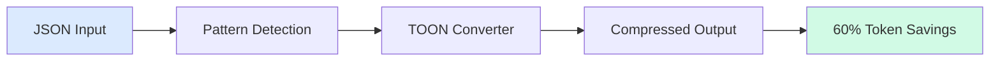
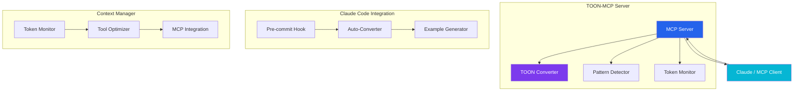

<div class="hero">
    <h1>🔧 TOON-MCP</h1>
    <p>Token-Optimized Object Notation for Efficient AI Context Management</p>
    <div>
        <a href="{{ '/guides/setup' | relative_url }}" class="btn">Get Started</a>
        <a href="https://github.com/aj-geddes/toon-context-mcp" class="btn btn-secondary">View on GitHub</a>
    </div>
</div>

## What is TOON-MCP?

TOON-MCP is a Model Context Protocol server that automatically converts verbose JSON structures into **Token-Optimized Object Notation (TOON)**, reducing token consumption in AI-assisted development workflows by up to **60%**.

Perfect for developers working with:
- Large codebases
- Complex API responses
- Data-heavy MCP tool integrations
- Token-constrained AI conversations

## Key Features

<div class="features-grid">
    <div class="feature-card">
        <div class="feature-icon">🚀</div>
        <h3>Smart Compression</h3>
        <p>Automatic pattern detection and intelligent JSON optimization</p>
    </div>

    <div class="feature-card">
        <div class="feature-icon">📊</div>
        <h3>Token Monitoring</h3>
        <p>Real-time tracking of conversation token usage with optimization recommendations</p>
    </div>

    <div class="feature-card">
        <div class="feature-icon">🔌</div>
        <h3>MCP Integration</h3>
        <p>Seamless integration with Claude and other MCP clients</p>
    </div>

    <div class="feature-card">
        <div class="feature-icon">🔄</div>
        <h3>Lossless Conversion</h3>
        <p>Perfect round-trip conversion between JSON and TOON</p>
    </div>

    <div class="feature-card">
        <div class="feature-icon">⚡</div>
        <h3>Auto-Optimization</h3>
        <p>Proactive conversion of tool outputs for maximum efficiency</p>
    </div>

    <div class="feature-card">
        <div class="feature-icon">📝</div>
        <h3>Pre-commit Hooks</h3>
        <p>Scan code for JSON and suggest TOON conversions</p>
    </div>
</div>

## Quick Example

Transform verbose JSON into compact TOON format:

**Original JSON** (142 tokens):
```json
{
  "id": 12345,
  "name": "John Doe",
  "email": "john@example.com",
  "type": "user",
  "status": "active",
  "metadata": {
    "created_at": "2025-01-01T00:00:00Z",
    "updated_at": "2025-01-15T10:30:00Z"
  }
}
```

**TOON Format** (68 tokens, 52% reduction):
```json
{"_toon":"1.0","d":{"i":12345,"n":"John Doe","eml":"john@example.com","t":"user","s":"active","meta":{"ca":"2025-01-01T00:00:00Z","ua":"2025-01-15T10:30:00Z"}}}
```

## How It Works



## Architecture Overview



## Getting Started

<div class="card">
    <h3>Installation</h3>
    <pre><code>pip install -e mcp-server-toon/</code></pre>
</div>

<div class="card">
    <h3>Configuration</h3>
    <p>Add to your MCP settings:</p>
    <pre><code>{
  "mcpServers": {
    "toon": {
      "command": "python",
      "args": ["-m", "src.server"]
    }
  }
}</code></pre>
</div>

<div class="card">
    <h3>Usage</h3>
    <pre><code>from src.toon_converter import convert_json_to_toon

toon_format = convert_json_to_toon(your_json_data)</code></pre>
</div>

## Why TOON?

<div class="alert alert-info">
    <strong>📈 Token Efficiency Matters</strong><br>
    In AI-assisted development, token limits can constrain your workflow. TOON helps you:
    <ul>
        <li>Fit more context in conversations</li>
        <li>Reduce API costs</li>
        <li>Improve response times</li>
        <li>Work with larger datasets</li>
    </ul>
</div>

## Next Steps

- 📚 [Setup Guide]({{ '/guides/setup' | relative_url }}) - Install and configure TOON-MCP
- 📖 [User Guide]({{ '/guides/user-guide' | relative_url }}) - Learn how to use TOON effectively
- 🔧 [Troubleshooting]({{ '/guides/troubleshooting' | relative_url }}) - Common issues and solutions
- 📘 [API Reference]({{ '/api/reference' | relative_url }}) - Complete API documentation

## Community & Support

- GitHub: [aj-geddes/toon-context-mcp](https://github.com/aj-geddes/toon-context-mcp)
- Issues: [Report a bug](https://github.com/aj-geddes/toon-context-mcp/issues)
- Discussions: [Join the conversation](https://github.com/aj-geddes/toon-context-mcp/discussions)

---

<p style="text-align: center; color: #6b7280;">
    Built with ❤️ for the AI development community
</p>
